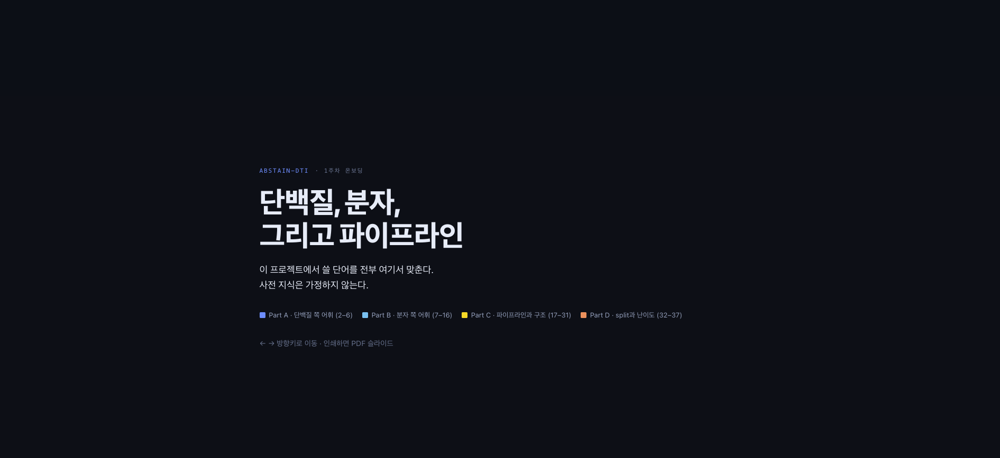

## Agenda

- 스터디 룰 소개
- 자기소개 (업무, 위치, 취미 1개)
- Abstain-DTI를 위한 온보딩
- 트랙 선정 및 트랙 리더 선정
- 주차별 회의록 담당자 선정
- GPU 실물 확보 및 LLM API credit
- 트랙별로 모여서 다음 주 발표할 논문 고르기
- **오늘의 목표:** PR 하나씩 올리기
- **HW:** 논문 발표자료 정리해서 깃헙에 올리기

## 스터디 룰 소개

- 2회 이상 무단 불참 시 제명
- 카메라 on 필수

## 자기소개

**Yeji Bae**

Data Scientist / Computational Biologist at Seattle Children's Hospital & Research Institute

- Multi-omics Analysis
- DL model development (fine-tuning)
- Agent Engineering

## Abstain-DTI를 위한 온보딩

- 문제 정의 : 
- 난이도 정의 : 
- INPUT & OUTPUT : 

# 문제 정의

## 무엇이 문제인가

"LLM이 DTI 예측을 못 하는데도 그냥 답한다"에는 두 상황이 섞여 있습니다.

| 상황 | 문제인가 |
| --- | --- |
| 약이 타겟에 붙지 않는다 | 아닙니다. 정답이 `binds = false`일 뿐입니다 |
| 답할 근거가 없는 입력에 쉬운 입력과 같은 신뢰도로 답한다 | 문제입니다 |

- LLM만의 문제가 아닙니다. 지도학습 모델(A)과 Boltz-2(F)에도 같은 질문을 합니다.
- 기권 기능이 없어서 생기는 문제도 아닙니다. 신뢰도 점수가 난이도를 담고 있지 않으면, 기권 기능이 있어도 엉뚱한 문항에서 기권합니다.

## Problem statement

> DTI 예측기(지도학습 모델이든 LLM 에이전트든)는 입력이 자기가 아는 범위를 벗어나도 신뢰도를 낮추지 않을 수 있다.
> 지금까지의 평가는 정확도를 난이도별로 나눠 보았을 뿐, 신뢰도와 기권이 그 난이도를 따라가는지는 재지 않아, 이 결함이 있는지 알 수 없었다.

**벤치마크의 질문은 하나입니다.** 신뢰도, 또는 기권 결정이 사전에 정한 난이도 d(x)를 따라가는가?

- "결함이 있다"가 아니라 "아무도 재지 않았다"고 씁니다. 결함의 직접 근거는 아직 없습니다.
- 정답을 보기 전에 정할 수 있는 난이도 좌표가 필요합니다. 다음 절에서 정의합니다.

## 근거는 어디까지 있나

선행 문헌(Medea, Biomni, ToolUniverse, DrugAgent, LAB-Bench, BixBench) 중 AURC나 risk-coverage로 신뢰도의 순위를 잰 곳은 없습니다.

| 근거 | 내용 |
| --- | --- |
| LAB-Bench | Gemini 1.5 Pro와 GPT-4-turbo는 coverage가 낮아도 precision이 나아지지 않았습니다. 기권이 틀릴 문항에 몰리지 않았다는 신호로 읽지만, 이 해석은 우리 것입니다 |
| DrugAgent (kinase) | 쌍 단위 논문이 0편인 구간에서 ML+KG 기준선 대비 우위가 사라졌습니다. 그 구간에서 신뢰도도 떨어졌는지는 보고하지 않았습니다 |
| 기권 채점 | ToolUniverse는 기권을 오답으로, Medea와 BixBench는 분모 제외로 셉니다. LAB-Bench는 둘 다 보고합니다 |
| BixBench (MCQ) | 기권 보기를 주면 성능이 random에 가까워지고, 빼면 random보다 높아집니다 |

# 난이도 정의

## 난이도는 무엇에 대한 난이도인가

- 난이도는 (서열, SMILES) 자체의 속성이 아닙니다. **기준 코퍼스**에 대한 상대적 속성입니다.
- 조건 A의 기준은 BindingDB 학습 split입니다. LLM 에이전트의 기준은 사전학습 데이터와 도구가 닿는 모든 DB입니다.
- 예를 들어 A의 학습셋에 없는 타겟도, ChEMBL을 검색하는 에이전트에게는 단순 조회일 수 있습니다.
- 그래서 축마다 기준 코퍼스와 유효한 조건을 함께 적습니다.

## 난이도 좌표: 네 묶음

| 묶음 | 축 | 유효한 조건 |
| --- | --- | --- |
| 보편 난이도 | 타겟 성숙도 (Pharos TDL), 문헌 가용성 (새로 추가) | 전 조건 |
| 학습 split 기준 | 리간드 신규성 (Tanimoto, Murcko scaffold), 타겟 신규성 (서열 identity) | A에 직접. 나머지 조건에 통하는지는 검증 전 가정 |
| 구조 (조건부) | pocket pLDDT/PAE, 실험 구조 유무 | 구조를 쓰는 A, F. 티켓 04 실측 후 확정 |
| Boltz-2 (조건부) | 리간드 크기 (heavy atom 56개 초과), cofactor가 필요한 타겟 | F |
| 유효성 플래그 | 오염 축 (원측정 발행일), 실측값 직접 조회 여부 | 난이도가 아닙니다. 쿼리가 "예측"인지를 판정합니다 |

난이도 좌표는 모델에 입력하지 않습니다. 결과를 층화해 분석할 때만 씁니다.

## 난이도가 아닌 것: 라벨 노이즈

- "이 scaffold는 처음 본다"는 예측기가 알아차릴 수 있습니다.
- "이 IC50은 특이한 조건에서 쟀다", "5.9와 6.1의 경계다"는 알아차릴 수 없습니다. 입력이 아니라 정답의 속성입니다.
- 그래서 난이도 축에서 빼고, 평가셋 **포함 기준**으로 처리합니다.
  - 1 µM 경계를 걸치는 검열값, 반복 측정, 회색 구간(5.5-6.5 제외 권고), degrader
- 각 축이 실제 난이도를 대변하는지는 W06 baseline 오차가 축을 따라 커지는지로 검증합니다(티켓 05).

# INPUT & OUTPUT

## 모든 조건 공통

| 항목 | 정의 |
| --- | --- |
| 입력 | 단백질 서열 + 화합물 SMILES만. 타겟 식별자(UniProt ID 등)는 주지 않습니다 |
| 주 결정 | 결합 여부 `binds`. pAffinity ≥ 6.0 (Kd / Ki / IC50 ≤ 1 µM)이면 true |
| 출력 | `binds`와 신뢰도, 또는 기권 |
| 주 지표 | AURC, coverage 80%에서의 selective accuracy |
| 보조 | 회귀(pAffinity). Ki와 Kd 정확값 부분집합에서만 보고 |
| 데이터 | BindingDB `202610` 스냅샷의 CC BY 4.0 부분 (1,436,782행) |
| 음성 | 검열값 `>10 µM` + 측정된 약한 결합 (pAffinity < 6). decoy 합성은 쓰지 않습니다 |

## 트랙 간 흐름

1. **큐레이션 트랙**이 평가 쿼리와 난이도 좌표를 만듭니다 (`results/benchmark/`).
2. **ML과 보정 트랙**이 같은 쿼리로 조건 A와 F를 돌리고, conformal 절차를 구현합니다.
3. **에이전트 트랙**이 같은 쿼리로 조건 B, C, D를 돌리고 신뢰도 로그를 남깁니다.
4. 조건 E는 에이전트 신뢰도 로그에 ML 트랙의 conformal 절차를 씌운 것입니다.
5. 모든 조건의 출력을 난이도 좌표로 층화해 비교합니다.

## 큐레이션 트랙

| 단계 | 입력 | 출력 |
| --- | --- | --- |
| 쿼리 선정 | BindingDB `202610` CC BY 부분 (Articles + Patents) | 평가 쿼리 60-100개 (서열, SMILES, 정답 `binds`, 측정 종류, 출처) |
| 포함 기준 | 측정 메타데이터 (부등호, 반복 측정, 리간드 크기 등) | 제외 및 플래그 기록 |
| 좌표 계산 | 쿼리, A의 학습 split, Pharos, AlphaFold DB, PDB/SIFTS, 발행일 | 쿼리별 난이도 좌표와 유효성 플래그 |
| 교차 검증 | 쿼리 초안 | 2인 검증 기록, `results/benchmark/` 확정본 |

## ML과 보정 트랙

| 조건 | 입력 | 출력 |
| --- | --- | --- |
| A. 보정된 baseline | ESM-2 단백질 임베딩, Morgan fingerprint, AlphaFold DB pocket feature, 학습 split | `binds` 확률, conformal 예측 집합 (`{binds, not binds}`이면 기권) |
| F. Boltz-2 (GPU 조건부) | 서열 + SMILES, 난이도 층화 200쌍 | `affinity_probability_binary`, `ligand_iptm`, conformal 예측 집합 |
| E 절차 | 에이전트 트랙의 신뢰도 로그 | A와 같은 conformal 절차를 적용한 예측 집합 |

OpenFold3는 F에서 빠지고 구조 품질 레퍼런스로 씁니다. 조사한 co-folding 모델 7개 중 affinity를 출력하는 것은 Boltz-2뿐입니다.

## 에이전트 트랙

| 조건 | 입력 | 출력 (JSON) |
| --- | --- | --- |
| B. Zero-shot LLM | 서열 + SMILES, 도구 없음 | `binds`, `confidence`, `pAffinity`, `reasoning` |
| C. Agent | 서열 + SMILES, ToolUniverse MCP 도구 | B 필드 + `identified_target`, `direct_measurement_found`, `evidence` |
| D. Agent + 기권 | C와 같음, 기권 허용 | C 필드 + `abstain` |
| 반복 실행 | 같은 쿼리 3회, temperature 0.7 | flip rate, 조건 E용 신뢰도 로그, 토큰·지연·비용 |
| 교란 감사 | 도구 출력에 오류 4종 주입 (단위, 엔트리, 동일성, 식별자) | 교란 탐지율 |

## 온보딩 자료

:::: {.columns}
::: {.column}

:::
::: {.column}
- 웹: <https://claude.ai/artifact/VkNjGDDxE9S8b8eZsnMpjv>
- 저장소: [docs/onboarding/w01-drug_development_onboarding.html](https://github.com/Pseudo-Lab/abstain-dti/blob/dev/docs/onboarding/w01-drug_development_onboarding.html) (내려받아 브라우저로 열기)
:::
::::

## PR 올리기

<https://github.com/Pseudo-Lab/abstain-dti>

- 트랙 작업: 작업 브랜치 → 자기 트랙 브랜치 → dev 로 PR (리뷰어 1명 이상)
- 트랙과 무관한 작업: dev에서 브랜치 → dev 로 PR
- README.md 팀 테이블 이름에 깃헙 링크 달기
- HW: 다음 주 발표할 논문 정리해서 자료 올리기
  -  논문 → 실행: <https://github.com/ybaeus/Paper2Agent>

## Feedbacks will be given by

- UW Andre Berndt Lab postdoc 이다호 박사님 ([scholar](https://scholar.google.com/citations?user=hpQO_7QAAAAJ&hl=en))
- UW David Baker Lab postdoc 신호정 박사님 ([scholar](https://scholar.google.com/citations?user=_PQ86mEAAAAJ&hl=ko))
- Duke PhD candidate 김종현님
  - Kim, J. and Romero, P.A. (2026) 'Benchmarking and behavioral characterization of LLM agents for protein design', bioRxiv

## Thank you! {.unnumbered}
